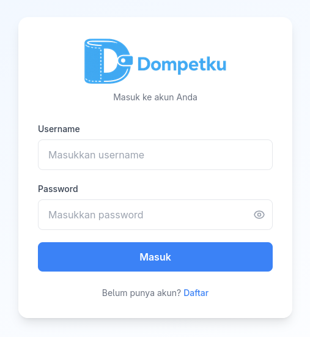
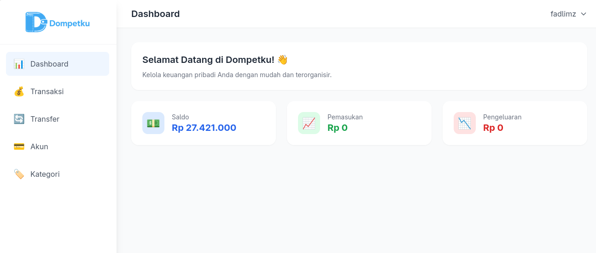
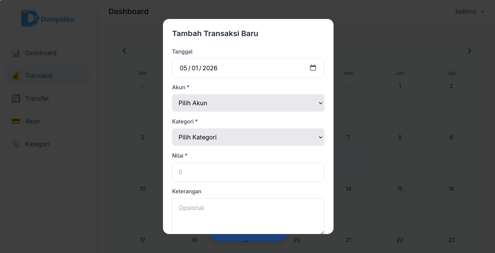
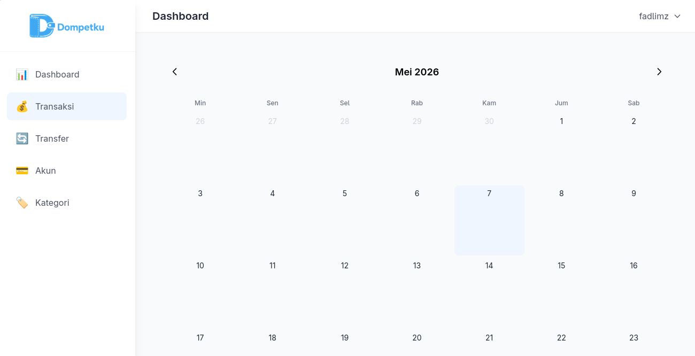

# 💰 Dompetku

[](https://openjdk.org/)
[](https://spring.io/projects/spring-boot)
[](https://angular.io/)
[](https://www.postgresql.org/)

Aplikasi manajemen keuangan pribadi yang membantu Anda melacak transaksi, mengelola akun, dan mengategorikan pengeluaran/pemasukan dengan mudah. Dibangun dengan Spring Boot di backend dan Angular di frontend.

## 📸 Tampilan Aplikasi

### Halaman Login



### Dashboard



### Input Transaksi



### Kalender Transaksi



## ✨ Fitur Utama

- 🔐 **Otentikasi Aman** - Registrasi dan login dengan JWT
- 💳 **Manajemen Akun** - Kelola akun keuangan dengan saldo
- 💰 **Pencatatan Transaksi** - Catat pemasukan dan pengeluaran harian
- 🔄 **Transfer Antar Akun** - Pindahkan saldo antar akun dengan mudah
- 🏷️ **Kategori Transaksi** - Kategorikan pemasukan dan pengeluaran
- 📊 **Dashboard** - Ringkasan saldo, pemasukan, dan pengeluaran
- 📅 **Kalender Transaksi** - Lihat transaksi dalam tampilan kalender

## 🛠️ Tech Stack

### Backend
- **Framework**: Spring Boot 3.5.0
- **Bahasa**: Java 17
- **Database**: PostgreSQL 15
- **Keamanan**: Spring Security + JWT
- **ORM**: Hibernate/JPA
- **Build Tool**: Gradle

### Frontend
- **Framework**: Angular 19.2.0 (Standalone Components)
- **Bahasa**: TypeScript 5.7
- **Styling**: TailwindCSS 3.x
- **HTTP Client**: Angular HttpClient dengan interceptors
- **Routing**: Lazy loading modules

## 📂 Struktur Proyek

```
dompetku/
├── backend/                    # Spring Boot API
│   ├── src/main/java/         # Source code Java
│   │   └── com/fadlimz/dompetku/
│   │       ├── base/          # Entity, DTO, BaseService
│   │       ├── config/        # Security & konfigurasi
│   │       ├── user/          # Modul pengguna
│   │       └── ...            # Modul lainnya
│   └── src/main/resources/    # Konfigurasi
├── frontend/                   # Angular UI
│   ├── src/app/
│   │   ├── core/              # Guards, interceptors, services
│   │   ├── features/          # Halaman (auth, dashboard, dll)
│   │   └── shared/            # Komponen bersama (layout)
│   └── environments/          # Konfigurasi environment
├── docs/screenshots/           # Screenshot aplikasi
├── docker-compose.yml          # Docker PostgreSQL
├── schema.prisma               # Skema database
└── scripts/                    # Script bantuan
```

## 🚀 Cara Menjalankan

### Prasyarat

- Java 17
- Node.js 18+
- Docker & Docker Compose (opsional)
- Gradle (wrapper sudah disertakan)

### Opsi 1: Docker Compose (Direkomendasikan)

Jalankan database PostgreSQL dengan Docker Compose:

```bash
docker-compose up -d
```

### Opsi 2: Manual Setup

#### 1. Setup Database

Pastikan PostgreSQL sudah berjalan dan buat database:

```bash
createdb dompetku
```

#### 2. Jalankan Backend

```bash
# Set environment variables
export DATABASE_URL="jdbc:postgresql://localhost:5432/dompetku"
export DB_USERNAME="postgres"
export DB_PASSWORD="password"

# Build dan jalankan
cd backend
./gradlew bootRun
```

Backend akan berjalan di `http://localhost:8080`

#### 3. Jalankan Frontend

```bash
cd frontend
npm install
npm run start
```

Frontend akan berjalan di `http://localhost:4200`

## 🔧 Konfigurasi

### Backend (`application.properties`)

```properties
spring.datasource.url=jdbc:postgresql://localhost:5432/dompetku
spring.datasource.username=${DB_USERNAME}
spring.datasource.password=${DB_PASSWORD}
spring.jpa.hibernate.ddl-auto=update
```

### Environment Variables

| Variable | Deskripsi | Default |
|----------|-----------|---------|
| `DATABASE_URL` | URL koneksi database | `jdbc:postgresql://localhost:5432/dompetku` |
| `DB_USERNAME` | Username database | `postgres` |
| `DB_PASSWORD` | Password database | `password` |

## 👤 Panduan Pengguna

### 1. Registrasi Akun

1. Buka halaman login (`/auth/login`)
2. Klik link **"Daftar sekarang"** untuk menuju halaman registrasi
3. Isi form registrasi:
   - Username (maks. 15 karakter)
   - Nama lengkap (opsional)
   - Email (opsional)
   - Password
4. Klik **"Daftar"** untuk membuat akun
5. Setelah berhasil, Anda akan diarahkan ke halaman login

### 2. Login

1. Buka halaman login (`/auth/login`)
2. Masukkan username dan password yang sudah didaftarkan
3. Klik **"Login"** untuk masuk ke aplikasi
4. Anda akan diarahkan ke dashboard

> **Tip:** Klik ikon mata pada field password untuk melihat/menyembunyikan password.

### 3. Dashboard

Setelah login, Anda akan melihat dashboard yang menampilkan:

- **Saldo Total** - Total saldo dari semua akun aktif
- **Total Pemasukan** - Jumlah pemasukan dalam periode tertentu
- **Total Pengeluaran** - Jumlah pengeluaran dalam periode tertentu
- **Aksi Cepat** - Tombol untuk menambah transaksi, transfer, dll.

### 4. Mengelola Akun Keuangan

1. Klik menu **"Akun"** di sidebar (desktop) atau bottom nav (mobile)
2. Anda akan melihat daftar akun dalam bentuk card
3. **Menambah Akun Baru:**
   - Klik tombol **"+ Tambah Akun"** yang mengambang di bawah
   - Isi form:
     - **Kode Akun** (unik)
     - **Nama Akun**
     - **Status Aktif** (toggle on/off)
   - Klik **"Simpan"**
4. **Mengedit Akun:**
   - Klik card akun yang ingin diedit
   - Ubah informasi yang diperlukan
   - Klik **"Simpan"**

### 5. Mencatat Transaksi

1. Klik menu **"Transaksi"** di sidebar
2. Klik tombol **"+ Tambah Transaksi"**
3. Isi form transaksi:
   - **Tanggal** transaksi
   - **Tipe** (Pemasukan / Pengeluaran)
   - **Kategori** (pilih dari daftar yang sudah dibuat)
   - **Akun** (pilih akun yang digunakan)
   - **Jumlah** uang
   - **Deskripsi** (opsional)
4. Klik **"Simpan"** untuk menyimpan transaksi

> **Tip:** Anda juga bisa melihat transaksi dalam tampilan kalender untuk melihat pola pengeluaran/pemasukan bulanan.

### 6. Transfer Antar Akun

1. Klik menu **"Transfer"** di sidebar
2. Klik tombol **"+ Tambah Transfer"**
3. Isi form transfer:
   - **Tanggal** transfer
   - **Dari Akun** (sumber dana)
   - **Ke Akun** (tujuan transfer)
   - **Jumlah** uang
   - **Deskripsi** (opsional)
4. Klik **"Simpan"** untuk memproses transfer

> **Catatan:** Transfer akan mengurangi saldo dari akun sumber dan menambah saldo akun tujuan secara otomatis.

### 7. Mengelola Kategori

1. Klik menu **"Kategori"** di sidebar
2. Anda akan melihat daftar kategori yang dikelompokkan:
   - **Pemasukan** (Income)
   - **Pengeluaran** (Expense)
3. **Menambah Kategori Baru:**
   - Klik tombol **"+ Tambah Kategori"**
   - Isi form:
     - **Kode Kategori** (unik)
     - **Nama Kategori**
     - **Tipe** (Pemasukan / Pengeluaran)
     - **Status Aktif** (toggle on/off)
   - Klik **"Simpan"**

## 📡 API Endpoints

### Endpoint Publik

| Method | Endpoint | Deskripsi |
|--------|----------|-----------|
| `GET` | `/hello` | Cek kesehatan API |
| `POST` | `/api/users` | Registrasi pengguna baru |
| `POST` | `/api/auth/login` | Login pengguna |

### Endpoint Terproteksi (Memerlukan JWT Token)

| Method | Endpoint | Deskripsi |
|--------|----------|-----------|
| `GET/POST/PUT/DELETE` | `/api/accounts/**` | CRUD Akun |
| `GET/POST/PUT/DELETE` | `/api/categories/**` | CRUD Kategori |
| `GET/POST/PUT/DELETE` | `/api/transactions/**` | CRUD Transaksi |
| `GET/POST/PUT/DELETE` | `/api/transfers/**` | CRUD Transfer |

> **Catatan:** Untuk mengakses endpoint terproteksi, sertakan header `Authorization: Bearer <token>` pada setiap request.

## 🗄️ Skema Database

Aplikasi ini menggunakan PostgreSQL dengan entitas utama:

- **User** - Data pengguna dengan otentikasi
- **Account** - Akun keuangan dengan saldo
- **Category** - Kategori transaksi (Pemasukan/Pengeluaran)
- **DailyCash** - Transaksi harian (pemasukan/pengeluaran)
- **AccountBalance** - Saldo per akun
- **AccountBalanceTransfer** - Transfer antar akun
- **TransactionCode** - Kode referensi transaksi

## 🧪 Pengujian

### Backend

```bash
# Jalankan semua tes
./gradlew test

# Jalankan dengan coverage
./gradlew test jacocoTestReport
```

### Frontend

```bash
cd frontend

# Jalankan tes unit
npm run test

# Jalankan tes end-to-end
npm run e2e
```

## 📝 Kontribusi

Kontribusi sangat dipersilakan! Berikut panduan singkat:

1. Fork repository ini
2. Buat branch fitur (`git checkout -b fitur/baru`)
3. Commit perubahan (`git commit -m 'menambahkan fitur baru'`)
4. Push ke branch (`git push origin fitur/baru`)
5. Buat Pull Request

### Konvensi Kode

- Backend mengikuti standar Spring Boot dengan satu Service per Entity
- Frontend menggunakan Standalone Components (tanpa NgModule)
- Gunakan DTO untuk transfer data antar layer
- Semua komponen UI menggunakan TailwindCSS